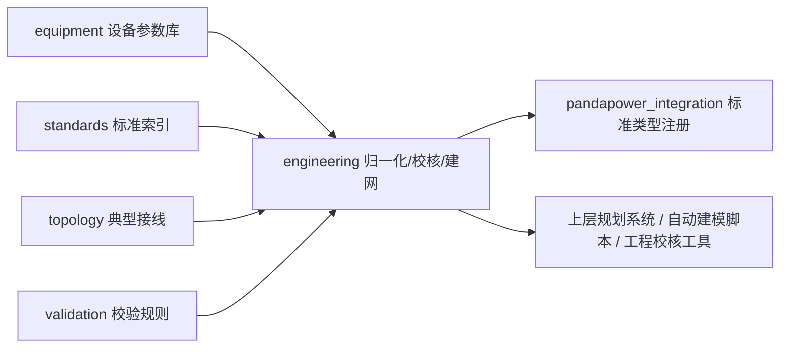

# cnpower 项目说明手册

面向项目接手、工程使用、二次开发和自动化引擎读取。

## 1. 一句话理解

`cnpower` 是面向中国配电网规划、仿真建模、设备选型和工程校核的 Python 工程参数库。它把常用设备数据、标准索引、典型接线、字段归一化、合规约束和 `pandapower` 建网能力整理成稳定接口，适合作为配网规划系统、资产建模脚本或工程校核工具的参数底座。

它不是正式设计成果的替代品。正式工程仍应以现行标准、当地电网公司要求、厂家试验报告、项目边界条件和审查意见为准。

## 2. 项目边界

适合使用的场景：

- 查询中国配电网常用设备参数和标准引用。
- 把工程资产台账字段归一化为仿真/校核字段。
- 向 `pandapower` 网络注册中文线路、变压器、三绕组变压器和熔断器标准类型。
- 从工程资产字典构建可运行的 `pandapower` 网络。
- 对设备字段和潮流/短路结果做规则化合规检查。
- 为上层规划平台、台区改造工具、分布式电源接入分析或资产建模流水线提供机器可读数据。

不应直接替代的内容：

- 项目现场勘测和施工图设计。
- 厂家试验报告、保护定值单和地方电网审查意见。
- 完整潮流、短路、暂态、电磁暂态或保护整定计算引擎。
- 对 `engineering_policy`、`manufacturer_typical_or_engineering_default`、`project_specific_required` 字段的工程复核。

## 3. 系统概览



核心模块：

| 模块 | 作用 | 主要入口 |
|---|---|---|
| `cnpower.equipment` | 设备参数库 | `get_all_transformers`, `get_all_cables`, `get_all_overhead_lines` |
| `cnpower.equipment.new_energy` | 新能源、储能、充电设备 | `get_all_photovoltaic`, `get_all_wind_turbines`, `get_all_energy_storage`, `get_all_ev_chargers` |
| `cnpower.engineering` | 工程归一化、合规检查、建网 | `normalize_equipment`, `check_equipment_compliance`, `build_pandapower_net` |
| `cnpower.pandapower_integration` | pandapower 标准类型 | `add_chinese_std_types`, `chinese_line_std_types` |
| `cnpower.standards` | 标准索引 | `get_all_standards` |
| `cnpower.topology` | 典型接线方式 | `get_all_connection_modes` |
| `cnpower.validation` | 规划与运行校验规则 | `get_all_validation_rules` |

## 4. 数据覆盖

当前设备库共 662 个模型，覆盖 12 类对象。

| 模块 | 数量 | 分类 |
|---|---:|---|
| 变压器 | 212 | 油浸式 72、干式 90、箱变 20、35kV 主变 13、110kV 主变 9、110kV 三绕组变 8 |
| 电缆 | 178 | 10kV 电缆 44、35kV 电缆 36、0.4kV 电缆 84、110kV 电缆 14 |
| 架空线路 | 82 | 10kV 架空绝缘线 16、0.4kV 架空绝缘线 30、裸导线 36 |
| 开关设备 | 61 | 开关柜 4、中压断路器 21、负荷开关 3、中压熔断器 3、低压断路器 25、重合器 2、分段器 3 |
| 无功补偿 | 29 | 中压电容器组 11、低压电容器组 9、SVG 9 |
| 保护配置 | 10 | 中压线路保护 6、变压器保护 4 |
| 互感器 | 32 | 中压 CT 15、低压 CT 13、中压 PT 4 |
| 避雷器 | 4 | 中压避雷器 3、低压避雷器 1 |
| 光伏 | 17 | 光伏组件 3、组串式逆变器 10、集中式逆变器 4 |
| 充电桩 | 9 | 交流慢充 3、直流快充 4、直流超充 2 |
| 储能 | 19 | 磷酸铁锂电池 8、铅碳电池 5、PCS 6 |
| 风机 | 9 | 小型分布式风机 5、中型分布式风机 4 |

机器可读清单在 [`../cnpower_library_manifest.json`](../cnpower_library_manifest.json)。

## 5. 数据字段约定

设备参数尽量同时服务两类消费者：

- 仿真建模：保留 `pandapower` 需要的扁平字段，如 `r_ohm_per_km`、`x_ohm_per_km`、`c_nf_per_km`、`max_i_ka`、`sn_mva`、`vk_percent`。
- 工程校核：补充额定电流、热稳定、动稳定、保护配置、负载策略、寿命和来源类型等结构化字段。

典型字段：

| 对象 | 常用字段 |
|---|---|
| 变压器 | `sn_kva`, `vn_hv_kv`, `vn_lv_kv`, `vk_percent`, `vkr_percent`, `shift_degree`, `rated_current_hv_a`, `rated_current_lv_a`, `loading_limits`, `thermal_model` |
| 电缆 | `r_ohm_per_km`, `x_ohm_per_km`, `c_nf_per_km`, `max_i_ka_air`, `max_i_ka_ground`, `ampacity_reference`, `thermal_limits`, `short_circuit_rating` |
| 架空线 | `r_ohm_per_km`, `x_ohm_per_km`, `max_i_ka`, `rated_current_a`, `r0_ohm_per_km`, `x0_ohm_per_km`, `c0_nf_per_km`, `mechanical_limits` |
| 开关/熔断器 | `rated_voltage_kv`, `rated_current_a`, `rated_short_circuit_breaking_ka`, `rated_short_time_duration_s`, `time_current_curve` |
| 新能源/负荷 | `rated_power_kw`, `rated_voltage_v`, `power_factor`, `p_mw`, `q_mvar`, `sn_mva`, `soc_percent`, `max_e_mwh` |

字段来源类型：

| 来源类型 | 含义 |
|---|---|
| `standard_table` | 标准表格直接数值 |
| `derived_formula` | 由铭牌参数或标准公式派生 |
| `standard_reference` | 有明确标准依据的方法、要求或引用 |
| `standard_reference_and_engineering_default` | 有标准依据，但当前库采用保守工程默认 |
| `engineering_policy` | 规划口径或工程策略默认 |
| `manufacturer_typical_or_engineering_default` | 厂家样本典型值或工程占位值 |
| `project_specific_required` | 必须由具体项目、厂家资料或现场条件补充 |

## 6. 安装与环境

基础安装：

```bash
pip install cnpower
```

需要 `pandapower`：

```bash
pip install "cnpower[pandapower]"
```

源码开发：

```bash
git clone https://github.com/Gawg-AI/cnpower.git
cd cnpower
pip install -e ".[dev]"
python -m pytest
python verify_fixes.py
```

Python 要求：`>=3.10`。CI 目标版本：3.10、3.11、3.12、3.13。

## 7. 快速使用

### 7.1 查询设备

```python
from cnpower.equipment import get_all_transformers

transformers = get_all_transformers()
trafo = transformers["oil_immersed"]["S13-630/10"]

print(trafo["sn_kva"])
print(trafo["rated_current_hv_a"])
print(trafo["rated_current_lv_a"])
```

### 7.2 归一化工程字段

```python
from cnpower.engineering import normalize_equipment

item = normalize_equipment(
    "ev_charger",
    {"rated_power_kw": 14, "rated_voltage_v": 380, "power_factor": 0.95},
)

print(item["p_mw"])
print(item["q_mvar"])
```

### 7.3 合规检查

```python
from cnpower.engineering import check_equipment_compliance

result = check_equipment_compliance(
    "transformer",
    {"sn_kva": 630, "vn_hv_kv": 10, "vn_lv_kv": 0.4, "rated_current_a": 36.4},
    {"operating_voltage_kv": 10, "max_current_a": 35, "loading_percent": 70},
)

print(result["summary"])
```

### 7.4 注册 pandapower 标准类型

```python
import pandapower as pp
from cnpower.pandapower_integration import add_chinese_std_types

net = pp.create_empty_network()
add_chinese_std_types(net)
```

### 7.5 从资产字典建网

```python
from cnpower.engineering import build_pandapower_net

net = build_pandapower_net(
    {
        "buses": [
            {"id": "grid", "vn_kv": 10.0},
            {"id": "load_bus", "vn_kv": 0.4},
        ],
        "ext_grids": [{"bus": "grid", "vm_pu": 1.0}],
        "transformers": [
            {"id": "t1", "hv_bus": "grid", "lv_bus": "load_bus", "std_type": "S13-630/10"}
        ],
        "loads": [{"id": "load-1", "bus": "load_bus", "p_mw": 0.18, "q_mvar": 0.05}],
    },
    run_powerflow=True,
)
```

## 8. 标准索引和规则体系

标准索引包含 49 项标准引用。`related_equipment` 使用 canonical 英文 ID，`related_rules` 指向 `validation/rules.py` 中存在的规则 ID，便于程序化查询。

重要标准：

| 标准 | 用途 |
|---|---|
| `GB/T 6451-2023` | 油浸式电力变压器技术参数 |
| `GB/T 10228-2023` | 干式电力变压器技术参数 |
| `GB/T 1094.1-2013` | 电力变压器总则 |
| `GB/T 1094.7-2024` | 油浸式变压器负载导则 |
| `GB/T 1094.11-2022` | 干式变压器技术要求 |
| `GB/T 1094.12-2013` | 干式变压器负载导则 |
| `GB/T 12706.1~3-2020` | 1kV 到 35kV 挤包绝缘电力电缆 |
| `GB/T 1179-2017` | 圆线同心绞架空导线 |
| `GB/T 1984-2024` | 高压交流断路器 |
| `GB/T 15166.2-2023` | 高压交流熔断器 |
| `GB/T 18487.1-2023` | 电动车导电充电系统 |
| `GB/T 34131-2023` | 电化学储能站接入电网 |
| `GB/T 45418-2025` | 配电网通用技术导则 |

校验规则域：

| 规则域 | 覆盖内容 |
|---|---|
| `voltage_quality` | 电压偏差、电压波动和闪变、三相不平衡、谐波 |
| `n1_safety` | A/B/C/D/E 类供电区 N-1 要求 |
| `connection_modes` | 典型接线模式匹配 |
| `short_circuit` | 三相最大、单相最小、电缆热稳定 |
| `equipment_selection` | 变压器、导体、断路器等选型 |
| `reliability` | SAIDI、SAIFI |
| `renewable_connection` | 光伏、储能、充电设施接入和电能质量 |

## 9. pandapower 集成说明

`cnpower.pandapower_integration.std_types_cn` 会从设备库生成并缓存标准类型：

- 线路：电缆 + 架空线路。
- 两绕组变压器：油浸式、干式、箱变、35kV 主变、110kV 主变。
- 三绕组变压器：110kV 三绕组变。
- 熔断器：按熔断器型号和熔体电流系列展开。

注意：

- `pandapower` 是可选依赖，不安装时设备查询和多数工程校核仍可使用。
- 需要潮流或短路计算时，应安装 `cnpower[pandapower]`。
- `add_chinese_std_types(net)` 会把标准类型注册到已有 `pandapower` 网络。

## 10. 维护清单

新增或修改设备数据时：

1. 保留建模必需字段，例如 R/X/C、最大电流、短路电压、空载损耗。
2. 标注来源类型，避免把工程默认值伪装成标准表值。
3. 检查字段能否被 `normalize_equipment()` 识别。
4. 检查 `check_equipment_compliance()` 是否需要新的字段别名或规则。
5. 若影响 `pandapower`，同步检查 `std_types_cn.py`。
6. 更新对应测试和文档。

新增标准条目时：

1. `code` 必须唯一。
2. `related_equipment` 使用 canonical 英文 ID。
3. `related_rules` 必须指向 `validation/rules.py` 中存在的规则。
4. 标准编号应包含正确分部号，例如 `GB/T 1094.1-2013`、`GB/T 12706.1~3-2020`。

发布或交接前：

```bash
python -m pytest -q
python verify_fixes.py
```

当前期望：

- `python -m pytest -q`：全部通过。
- `python verify_fixes.py`：`756 PASS, 0 FAIL`。

## 11. 给自动化引擎的读取建议

优先读取顺序：

1. [`../cnpower_library_manifest.json`](../cnpower_library_manifest.json)：项目机器清单、模型数量、标准索引摘要、验证入口。
2. [`../README.md`](../README.md)：项目定位、快速使用、核心工作流。
3. 本文档：模块关系、字段语义、维护规则。
4. `cnpower/engineering/asset_schema.py`：资产对象 schema。
5. `cnpower/engineering/compliance_constraints.py`：合规约束库。
6. `cnpower/validation/rules.py`：规划与运行规则。

稳定入口优先级：

- 对外入口优先使用包级导出：`cnpower.equipment`、`cnpower.engineering`、`cnpower.standards`。
- 不建议引擎直接依赖内部 helper，除非测试或维护任务明确需要。
- 标准和规则匹配应使用 `code`、canonical `related_equipment`、`related_rules`，不要用中文显示名做主键。

## 12. 免责声明

本项目参数来自公开标准、工程常用口径和典型参数整理，仅供规划研究、仿真建模和工程初步校核参考。正式工程设计应以现行标准、当地电网公司要求、厂家试验报告、项目设计条件和审查意见为准。
